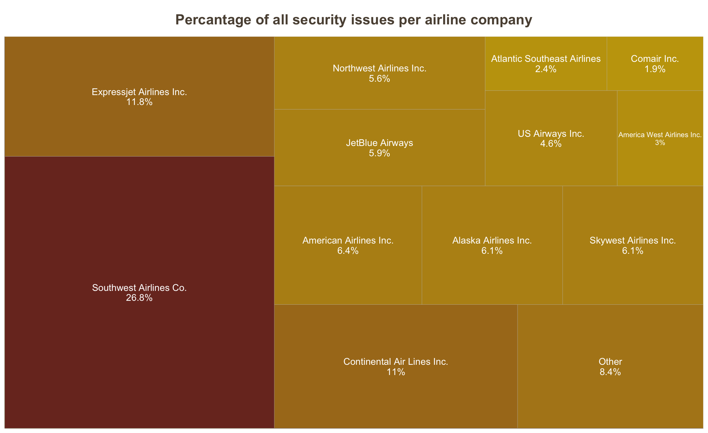
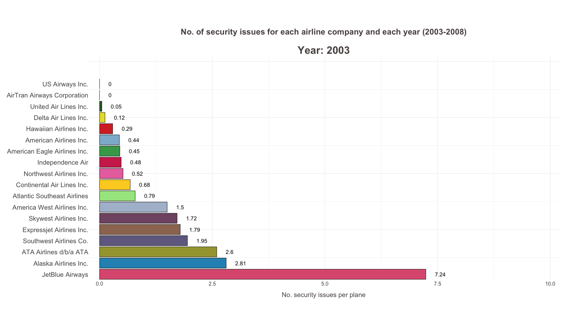
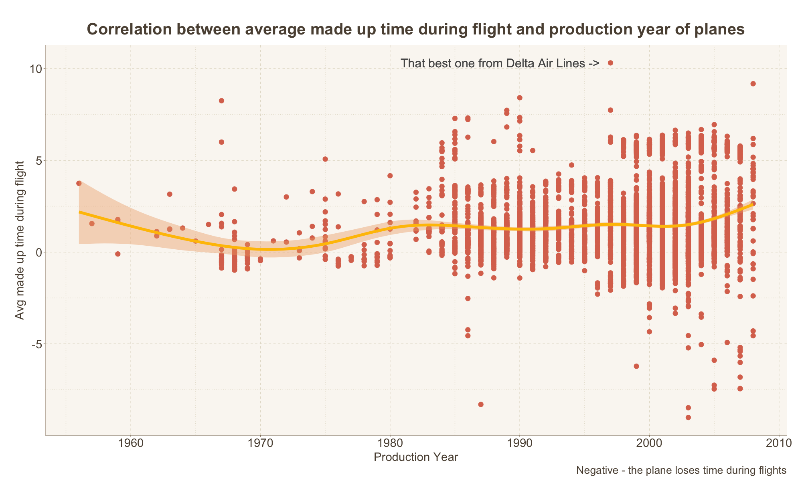

<!-- # ```{r seteup, include = FALSE}  -->

<!-- # source("../src/utils/MySqlConnect.R", local = knitr::knit_global()) -->

<!-- #  -->

<!-- # ``` -->

```{r include = F} 
library(dplyr)
library(data.table)
library(knitr)
```

# Które linie lotnicze są najmniej, a które najbardziej bezpieczne?
# Które mają najwięcej opóźnień?

## Problemy z bezpieczeństwem
```{r echo = F, out.width="100%"}
badSec <- fread(file = "../src/carrier/outputs/Bad_security_carrier.csv")
replace_0 <- badSec$NumSecurityProblems
replace_0[is.na(replace_0)] <- 0
badSec$NumSecurityProblems <- replace_0

sumSecProb <- sum(badSec$NumSecurityProblems)
badSec <- badSec %>%
  mutate(PercOfSecurityProblems = round(NumSecurityProblems/sumSecProb, 3)*100) %>%
  mutate(NumSecProbPerPlane = round(NumSecurityProblems / AvgNumPlanes, 2))

temp <- badSec$Description
temp[temp == "America West Airlines Inc. (Merged with US Airways 9/05. Stopped reporting 10/07.)"] <- "America West Airlines Inc."
temp[temp == "US Airways Inc. (Merged with America West 9/05. Reporting for both starting 10/07.)"] <- "US Airways Inc."
badSec$Description <- temp

badSec <- badSec %>%
  arrange(-NumSecProbPerPlane)

knitr::kable(head(badSec, 10))

```


## Problemy z bezpieczeństwem
{width=100%,height=100%}

## Problemy z bezpieczeństwem...
```{r echo=F, warning = F, fig.width=12, fig.height=7} 
suppressMessages(source("../src/carrier/carriersWithSecProblems.R", local = knitr::knit_global()))
interactivePlotSecProbPerPlane

```


## Problemy z bezpieczeństwem w czasie
{width=100%}

## Opóźnienia z winy przewoźnika ...
```{r echo = F, out.width="100%"}
data <- fread(file = "../src/carrier/outputs/Bad_carrier_carrier_in_minutes_by_year.csv")
data <- data %>%
  mutate(CollectiveCarrierDelay = round(CollectiveCarrierDelay/60, 2)) %>%
  mutate(DelayPerPlane = round(CollectiveCarrierDelay/NumPlanesThisYear, 2))

knitr::kable(head(data, 5))
```

## ...na przestrzeni lat
{width=100%,height=100%}

# Korelacja średnich opóźnień przewoźników i satysfakcji klientów

## Dane
https://www.statista.com/statistics/194941/customer-satisfaction-with-us-airlines-since-1995/
```{r echo=F, out.width="100%"}
satisfactionByYear <- fread(file = "../database/data/american-customer-satisfaction-index-scores-for-airlines-in-the-us-1995-2023.csv")
satisfactionByYear <- satisfactionByYear %>%
  rename(Year = V1) %>%
  select(Year, `Southwest Airlines`, `Delta Air Lines`, `United Airlines`, `American Airlines`) %>%
  filter(Year <= 2008 & Year >= 2003) %>%
  mutate(Year = as.numeric(Year))

values <- c()
tmp <- satisfactionByYear %>%
  select( `Southwest Airlines`, `Delta Air Lines`,`United Airlines`,`American Airlines` )
for(i in 1:nrow(tmp)) {
  values <- c(values, tmp[i])
}
names(values) <- NULL
values <- unlist(values)
satisfactionByYearTable <- data.frame(
  Year = rep(2003:2008, each = 4),
  Description = rep(c("Southwest Airlines Co.", "Delta Air Lines Inc.","United Air Lines Inc." ,"American Airlines Inc."), times = 6),
  SatisfactionIndex = values
)

kable(satisfactionByYearTable)

```

## Zmiany na przestrzeni lat
```{r echo=F, warning=F, fig.width=12, fig.height=7}
suppressMessages(source("../src/carrier/satisfactionAndPerformanceForCarrier.R", local = knitr::knit_global()))
plotSatiAnimated

```


# Najmniej opóźnieniogenne samoloty każdego przewoźnika

## Dane
```{r echo=F} 
suppressMessages(source("../src/carrier/BestPerformingPlanes.R", local = knitr::knit_global()))

kable(head(bestPlanesDep, 10))
```

## Najlepszy samolot pod względem Departure Delay
```{r echo=F}
t <- theBestPlaneDep %>%
  inner_join(plane_data, by=join_by(tailnum))
kable(t)
```

## Najlepszy samolot pod względem nadrabiania czasu podczas lotu
```{r echo=F}
t <- theBestPlaneCatchUp %>%
  inner_join(plane_data, by=join_by(tailnum))
kable(t)
```

## Zależność wyników samolotu od roku produkcji
{width="100%"}

## Zależność wyników samolotu od producenta
{width="100%"}

