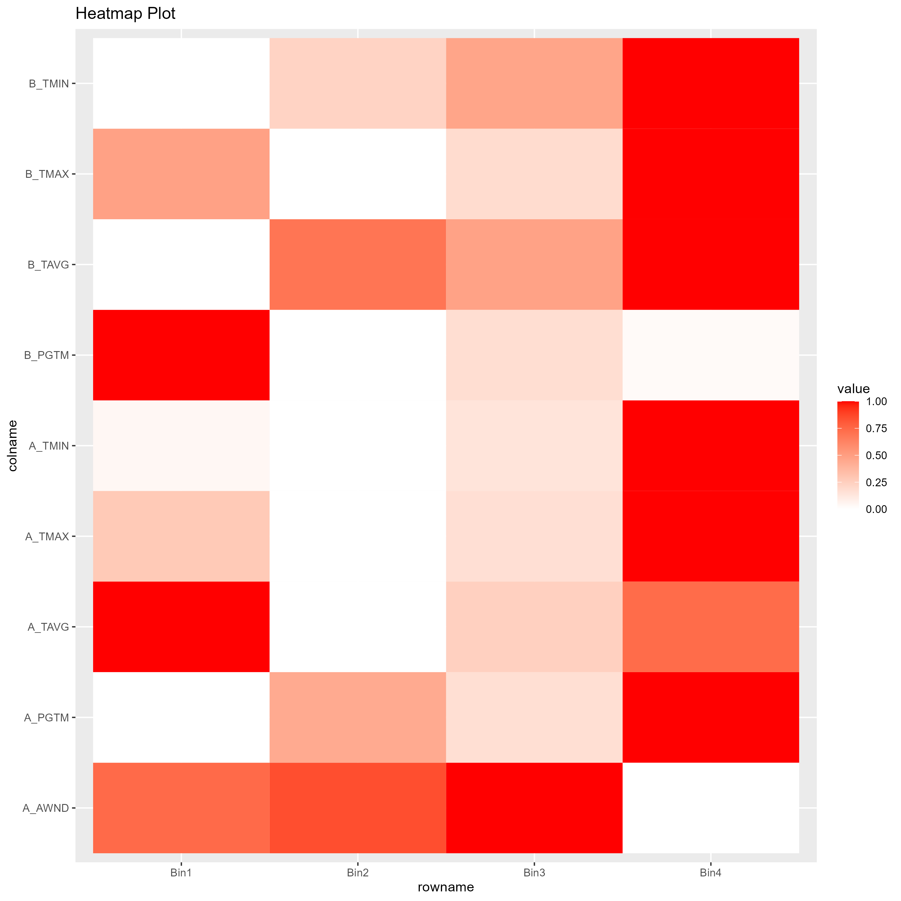
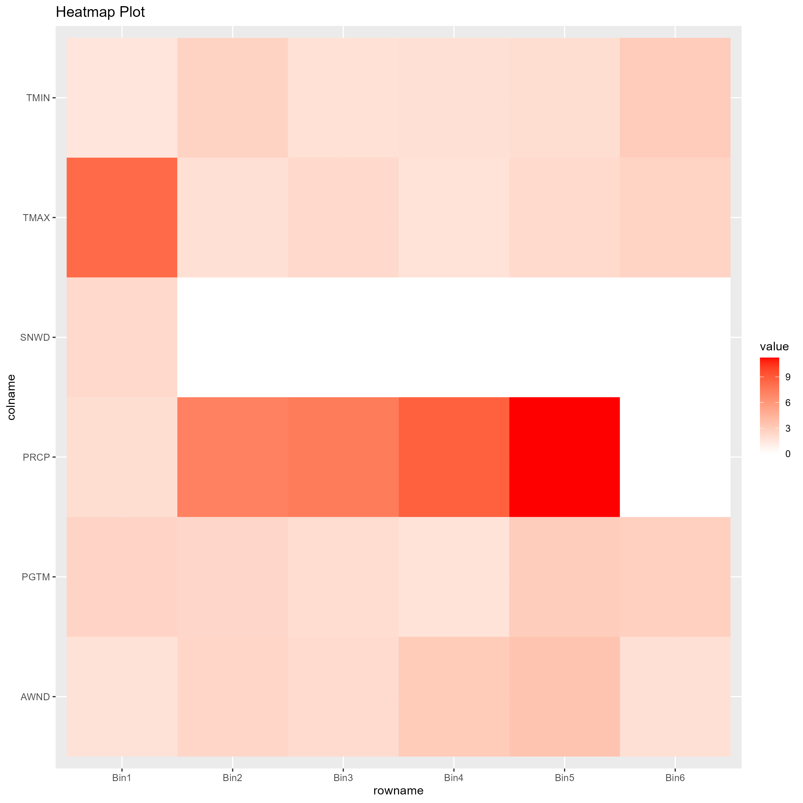

```{r setup, include=FALSE}
source("../src/utils/MySqlConnect.R", local = knitr::knit_global())

```

# Warunki pogodowe a loty

# Jak warunki pogodowe wpływają na opóźnienia lotów???

## Dane
Opis skąd dane
```{sql connection=db}
Select * from `atlanta-weather`
where TSUN is not null and AWND is not null and PRCP is not null
and TMAX is not null and TMIN is not null and SNOW is not null and SNWD is not null
limit 3;
```
Opis co znaczą poszczególne kolumny

Obczajka ile jest nulli

## Lotniska z najwięszką ilością opóźnień
```{sql eval=FALSE, connection=db}
Select airport, count(*) as totalFLights, avg(WeatherDelay) as averageWeatherDelay from main
inner join airports ON (Trim(main.Origin) = Trim('"' from airports.iata))
where Year between 2005 and 2007
group by airport
having totalFLights > 50000
order by averageWeatherDelay desc
limit 3;
```
```{r echo=FALSE}
data <- head(read.csv("../src/weather/outputs/delayedAirports.csv"), 5)
knitr::kable(data)
```

## Najbardziej opóźnione loty z Atlanty
```{sql eval=FALSE, connection=db, collapse=TRUE}
Select a2.city, count(*) as totalFlights, avg(WeatherDelay) as averageWeatherDelay from main m
inner join airports a1 ON (Trim(m.Origin) = Trim('"' from a1.iata))
inner join airports a2 ON (Trim(m.Dest) = Trim('"' from a2.iata))
where a1.city like '%Atlanta%'
and Year between 2005 and 2007
group by a2.city
having totalFlights > 1000
order by averageWeatherDelay desc
limit 3;
```
```{r echo=FALSE}
data <- head(read.csv("../src/weather/outputs/atlantaDestinations.csv"), 5)
knitr::kable(data)
```

## Tworzenie bazy danych Atlanta -> Baton Rouge
```{sql eval=FALSE, connection=db}
Create table AtlantaBT as (
SELECT date, count(*) totalFlights, sum(Cancelled) as cancelled, Avg(ArrDelay), Avg(DepDelay), AVG(TaxiIn),avg(TaxiOut), Avg(WeatherDelay)  from main m
inner join airports a1 ON (Trim(m.Origin) = Trim('"' from a1.iata))
inner join airports a2 ON (Trim(m.Dest) = Trim('"' from a2.iata))
where a1.city like '%Atlanta%' and a2.city like '%Baton Rouge%'
and Year between 2005 and 2007
group by date);
```
<details>
<summary>AAAAA</summary>

```{sql eval=TRUE, connection=db, fig.show="hide"}
SELECT
    a.date,
    avg(totalFlights) as totalFlights,
    avg(cancelled) as cancelled,
    Avg(`avg(ArrDelay)`) as ArrDelay,
    Avg(`avg(DepDelay)`) as DepDelay,
    Avg(`avg(TaxiIn)`) as TaxiIn,
    Avg(`avg(TaxiOut)`) as TaxiOut,
    Avg(`avg(WeatherDelay)`) as WeatherDelay,
    Avg(aw.AWND) as A_AWND,
    Avg(aw.PGTM) as A_PGTM,
    Avg(aw.PRCP) as A_PRCP,
    Avg(aw.TAVG) as A_TAVG,
    Avg(aw.TMAX) as A_TMAX,
    Avg(aw.TMIN) as A_TMIN,
    Avg(bw.AWND) as B_AWND,
    Avg(bw.PGTM) as B_PGTM,
    Avg(bw.PRCP) as B_PRCP,
    Avg(bw.TAVG) as B_TAVG,
    Avg(bw.TMAX) as B_TMAX,
    Avg(bw.TMIN) as B_TMIN
from AtlantaBT a
inner join `atlanta-weather` aw on (a.date = aw.DATE)
inner join `br-weather` bw on a.date = bw.DATE
group by date
limit 5;

```
</details>

## Analiza
<details>
<summary>A_AWND</summary>

</details>

<details>
<summary>A_PGTM</summary>

</details>

<details>
<summary>A_PRCP</summary>

</details>

<details>
<summary>A_TAVG</summary>

</details>

<details>
<summary>A_TMAX</summary>

</details>

<details>
<summary>A_TMIN</summary>

</details>

<details>
<summary>B_AWND</summary>

</details>

<details>
<summary>B_PGTM</summary>

</details>

<details>
<summary>B_PRCP</summary>

</details>

<details>
<summary>B_TAVG</summary>

</details>

<details>
<summary>B_TMAX</summary>

</details>

<details>
<summary>B_TMIN</summary>

</details>
<br/>
Inne wykresy

<details>
<summary>Delay heatmap</summary>

</details>

<details>
<summary>Delay heatmap2</summary>

</details>

Jeszcze inny wykres

<details>
<summary>Nwm</summary>


## Zmiana planów: Atlanta ale gdziekolwiek
<details>
<summary>AAAAA</summary>
```{sql eval=FALSE, connection=db, collapse=TRUE}
Create table atlanta as (Select date, a2.state, a2.city, Cancelled, Distance, ArrDelay,
    DepDelay, TaxiOut, TaxiIn, WeatherDelay
from main m
      inner join airports a1 ON (Trim(m.Origin) = Trim('"' from a1.iata))
      inner join airports a2 ON (Trim(m.Dest) = Trim('"' from a2.iata))
where a1.city like '%Atlanta%'
and year between 2005 and 2007);
```
</details>
<details>
<summary>AAAAA</summary>
```{sql eval=FALSE, connection=db, }
Select m.date,
       Count(*)            as Flights,
       sum(m.Cancelled)    as Cancelled,
       avg(m.Distance)     as Distance,
       avg(m.ArrDelay)     as ArrDelay,
       avg(m.DepDelay)     as DepDelay,
       avg(m.TaxiOut)      as TaxiOut,
       avg(m.TaxiIn)       as TaxiIn,
       avg(m.WeatherDelay) as WeatherDelay,
       avg(w.AWND)         as AWND,
       avg(w.PGTM)         as PGTM,
       avg(w.PRCP)         as PRCP,
       avg(w.SNOW)         as SNOW,
       avg(w.SNWD)         as SNWD,
       avg(w.TMAX)         as TMAX,
       avg(w.TMIN)         as TMIN
from atlanta m
         inner join `atlanta-weather` w on (m.date = w.date)
group by m.date
LIMIT 5;
```
</details>
```{r echo=FALSE}
data <- head(read.csv("../src/weather/outputs/atlantaAnwhrWeather.csv"), 5)
knitr::kable(data)
```

## Analiza
<details>
<summary>Comparison</summary>
<div style="width:100%; display: flex">


</div>
</details>

<details>
<summary>AWND</summary>

</details>

<details>
<summary>PGTM</summary>

</details>

<details>
<summary>PRCP</summary>

</details>

<details>
<summary>SNOW</summary>

</details>

<details>
<summary>SNWD</summary>

</details>

<details>
<summary>TMAX</summary>

</details>

<details>
<summary>TMIN</summary>

</details>

<br/>
Inne wykresy

<details>
<summary>Delay heatmap</summary>

</details>

<details>
<summary>Delay heatmap2</summary>

</details>